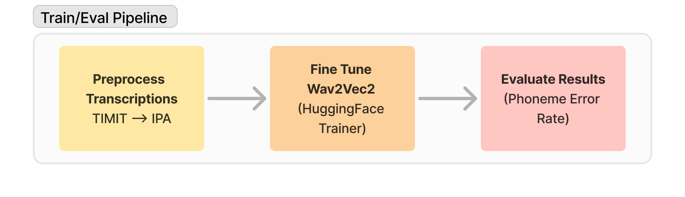
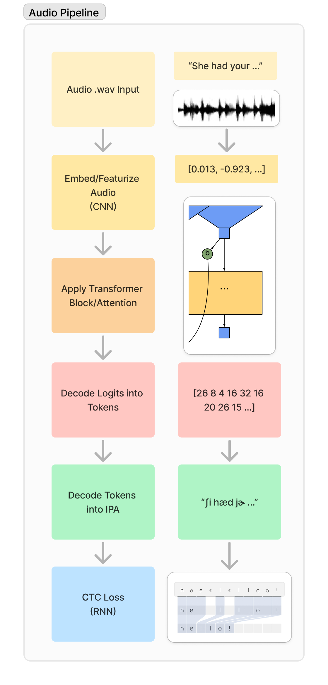

# Low Resource Automatic Speech Recognition (ASR)
___
## Introduction
 With the advances in Automatic Speech Recognition (ASR) for high-resource languages, this paper aims to open the door to understanding the magnitude of data needed for speech recognition tasks. 

In this paper, we compare **Wav2Vec2XLSR** (56K hours of data) against **Wav2Vec2IPA**, a fine-tuned Wav2Vec2-based architecture model trained on <5 hours of data from the TIMIT speech corpus (0.5% of baseline training data). From our evaluations, we find that the baseline model outperforms the smaller data model by 8.3 percentage points with respect to Phoneme Error Rate.

In addition, to address a gap in the availability of the TIMIT speech corpus, we also introduce 2 new datasets on HuggingFace Hub: 
- [`timit_asr`](https://huggingface.co/datasets/kylelovesllms/timit_asr)
- [`timit_asr_ipa`](https://huggingface.co/datasets/kylelovesllms/timit_asr_ipa)

Additionally, this research on smaller models intends to address current issues in Natural Language Processing (NLP) surrounding environmental sustainability and democratizing access to AI with the advent of small machine learning models.
### Paper
Click [here](https://github.com/Ky-Ng/IPA-ASR/blob/main/assets/paper.pdf) for a full writeup on the methods, motivation, and evaluation.
___
## Wav2Vec2IPA Pipeline

The 3 step `(1) Preprocess`, `(2) Fine Tune`, and `(3) Evaluate` pipeline above are implemented through `notebooks`, `datasets`, and `models`.
### Notebooks
- Each of the 3 phases of the pipeline are encapsulated into notebook files

| Pipeline Step      | Notebook                                                                                                                                                                                                                                                                                |
| ------------------ | --------------------------------------------------------------------------------------------------------------------------------------------------------------------------------------------------------------------------------------------------------------------------------------- |
| Data Preprocessing | [`preprocessing/split_data.ipynb`](https://github.com/Ky-Ng/IPA-ASR/blob/main/preprocessing/split_data.ipynb)                                                                                                                                                                           |
| Training           | [`training/fine_tune_w2v2.ipynb`](https://github.com/Ky-Ng/IPA-ASR/blob/main/training/fine_tune_w2v2.ipynb)                                                                                                                                                                             |
| Evaluation         | Baseline Evaluation [`evaluation/eval_model_xlsr.ipynb`](https://github.com/Ky-Ng/IPA-ASR/blob/main/evaluation/eval_model_xlsr.ipynb)  Wav2Vec2IPA  [`evaluation/eval_model_w2v2ipa.ipynb`](https://github.com/Ky-Ng/IPA-ASR/blob/main/evaluation/eval_model_w2v2ipa.ipynb) |
### Datasets
- We expand on the existing HuggingFace [`timit-asr/timit_asr`](https://huggingface.co/datasets/timit-asr/timit_asr) and contribute two HuggingFace datasets in this project:

| Name                                                                                         | Description                                                                               |
| -------------------------------------------------------------------------------------------- | ----------------------------------------------------------------------------------------- |
| [`kylelovesllms/timit_asr`](https://huggingface.co/datasets/kylelovesllms/timit_asr)         | Implementation of TIMIT dataset with Test and Train split                                 |
| [`kylelovesllms/timit_asr_ipa`](https://huggingface.co/datasets/kylelovesllms/timit_asr_ipa) | Implementation of  `kylelovesllms/timit_asr` with Validation Split and IPA Transcriptions |
****
- We expand on the existing HuggingFace [`timit-asr/timit_asr`](https://huggingface.co/datasets/timit-asr/timit_asr) and contribute two HuggingFace datasets in this project:

| Dataset                                                                                      | Description                                                                               |
| -------------------------------------------------------------------------------------------- | ----------------------------------------------------------------------------------------- |
| [`kylelovesllms/timit_asr`](https://huggingface.co/datasets/kylelovesllms/timit_asr)         | Implementation of TIMIT dataset with Test and Train split                                 |
| [`kylelovesllms/timit_asr_ipa`](https://huggingface.co/datasets/kylelovesllms/timit_asr_ipa) | Implementation of  `kylelovesllms/timit_asr` with Validation Split and IPA Transcriptions |
### Models
- Similar to `datasets`, the models used/trained in this project live in HuggingFace Hub

| Models                                                                                           | Description                                                     |
| ------------------------------------------------------------------------------------------------ | --------------------------------------------------------------- |
| [`facebook/XLSR-Wav2Vec2`](https://huggingface.co/docs/transformers/en/model_doc/xlsr_wav2vec2)  | Baseline Evaluation Model                                       |
| [`facebook/wav2vec2-base`](https://huggingface.co/facebook/wav2vec2-base)                        | Pretrained Wav2Vec2 Model                                       |
| [`Wav2Vec2IPA` and `Wav2Vec2IpaTokenizer`](https://huggingface.co/kylelovesllms/Wav2Vec2Ipa)  | Fine Tuned Model Wav2Vec2-Base model trained in this repository |
### Training Methodology

___
## Implementation

### Preprocess Transcriptions (Data Preprocessing)
#### Challenges Using Existing HuggingFace Dataset
Although HuggingFace has an implementation of the TIMIT database, [`timit-asr/timit_asr`](https://huggingface.co/datasets/timit-asr/timit_asr), there are problems that prevent us from using the HuggingFace Hub dataset directly:
1. TIMIT transcriptions are phonetic but not IPA (TIMIT has its own transcription system closely closely related to IPA)
2. The original TIMIT dataset contains only `Train` / `Test` dataset splits but no `Validation` dataset to tune hyper-parameters
3. HuggingFace `timit-asr/timit_asr` uses only `1/5` of the entire speech corpus (`<1 hour`).
	1. Since the dataset is `<5 hours` in total, using `1/5` of the dataset drastically impacts model performance
4. HuggingFace `timit-asr/timit_asr` uses a deprecated dataset API, requiring users to download the audio files via 3rd party zip.

#### Creating Custom HuggingFace Dataset
To address these issues, we contribute two datasets to HuggingFaceHub:
1. [`kylelovesllms/timit_asr`](https://huggingface.co/datasets/kylelovesllms/timit_asr) 
	1. Reimplementation of HuggingFace `timit_asr` with the full `Train` / `Test` dataset (5 hours total)
	2. Stores TIMIT database in native HuggingFace Hub Dataset API ([Parquet](https://huggingface.co/docs/dataset-viewer/en/parquet) format)
2. [`kylelovesllms/timit_asr_ipa`](https://huggingface.co/datasets/kylelovesllms/timit_asr_ipa)
	1. Builds off of `timit_asr` and adds:
		1. IPA transcriptions used for Wav2Vec2 Base fine-tuning
		2. Stratified Validation Dataset
			1. The validation dataset splits the Test Dataset in half following the [TIMIT recommendation](https://github.com/Ky-Ng/TIMIT-Database/blob/main/TIMIT/covleb.DOC) of having unique speakers between training and validation/test dataset
			2. Stratifies speaker population based on `speaker sex` and `speaker dialect region`
#### Preprocessing Scripts

- To (re)create the datasets, run the [`preprocessing/split_data.ipynb`](https://github.com/Ky-Ng/IPA-ASR/blob/main/preprocessing/split_data.ipynb) notebook
- Below lists the utils used in `split_data.ipynb`

| Dependency                                                                                                              | Description                                                                                                                                            |
| ----------------------------------------------------------------------------------------------------------------------- | ------------------------------------------------------------------------------------------------------------------------------------------------------ |
| [`timit_metadata_extractors.py`](https://github.com/Ky-Ng/IPA-ASR/blob/main/preprocessing/timit_metadata_extractors.py) | Handles metadata extraction (speaker `sex`, `dialect region`, `audio duration`) and extracts `transcriptions` at the sentence, word, and phoneme level |
| [`timit_ipa_translation.py`](https://github.com/Ky-Ng/IPA-ASR/blob/main/preprocessing/timit_ipa_translation.py)         | Helper to `timit_metadata_extractors` for handling TIMIT transcription to IPA mapping                                                                  |
| [`timit_dataset_splitter.py`](https://github.com/Ky-Ng/IPA-ASR/blob/main/preprocessing/timit_dataset_splitter.py)       | Helper to `timit_metadata_extractors` to stratify the Test dataset into Test and Validation                                                            |
### Training
- To train the wav2vec2 IPA base model into  run the [`evaluation/fine_tune_w2v2.ipynb`](https://github.com/Ky-Ng/IPA-ASR/tree/main/evaluation)
	- Note: the output tokens are learnable/can be found in `vocab_manual.json`
	- Note: to save the model, make sure to edit the `HF_ID` to your HuggingFace UserID

| Dependency                                                                                   | Description                                                                                                                                                                                                             |
| -------------------------------------------------------------------------------------------- | ----------------------------------------------------------------------------------------------------------------------------------------------------------------------------------------------------------------------- |
| [`vocab_manual.json`](https://github.com/Ky-Ng/IPA-ASR/blob/main/training/vocab_manual.json) | Learnable output tokens for final `softmax` layer in Wav2Vec2 Architecture.   Also contains `Connectionist Temporal Classification (CTC)` Loss token settings (`UNK`nown token, `PAD`ding token, and space token) |

### Evaluation
- To evaluate model performance, select one of the notebooks [`eval_model_w2v2ipa.ipynb`](https://github.com/Ky-Ng/IPA-ASR/blob/main/evaluation/eval_model_w2v2ipa.ipynb) to evaluate the fine tuned model and [`eval_model_xlsr.ipynb`](https://github.com/Ky-Ng/IPA-ASR/blob/main/evaluation/eval_model_xlsr.ipynb) to evaluate the baseline mode.
- At the time of writing, we implement vanilla `Character Error Rate (CER)` since the fine tuned model produces less tokens than the ground truth transcription (making `CER` effectively `normalized CER`)

| Dependency                                                                                 | Description                                                                           |
| ------------------------------------------------------------------------------------------ | ------------------------------------------------------------------------------------- |
| [`eval_helpers.py`](https://github.com/Ky-Ng/IPA-ASR/blob/main/evaluation/eval_helpers.py) | Removes extra symbols from baseline model to avoid mis-penalization during evaluation |
